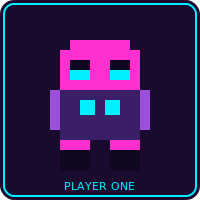
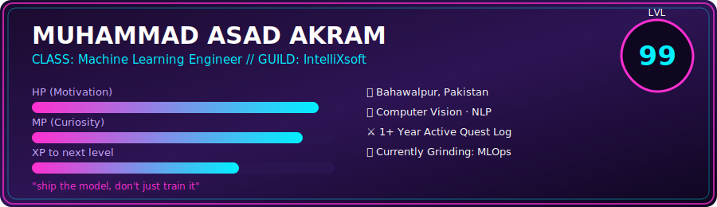
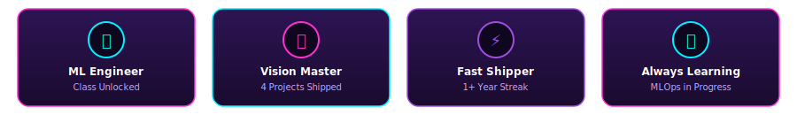

<table>
<tr>
<td width="18%"></td>
<td width="82%"></td>
</tr>
</table>

<br>

<div align="center">

[](https://www.linkedin.com/in/muhammadasadakram)
[](https://www.kaggle.com/asad30)
[](mailto:asadkhankhan3073@gmail.com)

</div>

<br>

## 🎮 Character Stats

<table>
<tr>
<td width="50%" valign="top">

**⚔️ Attack (Frameworks)**
```
TensorFlow   ▰▰▰▰▰▰▰▰▰▱  90
PyTorch      ▰▰▰▰▰▰▰▰▱▱  80
OpenCV       ▰▰▰▰▰▰▰▱▱▱  70
```

</td>
<td width="50%" valign="top">

**🛡️ Defense (Core Skills)**
```
Python       ▰▰▰▰▰▰▰▰▰▰ 100
FastAPI      ▰▰▰▰▰▰▰▰▱▱  80
React        ▰▰▰▰▰▰▱▱▱▱  60
```

</td>
</tr>
</table>

<br>

## 🗺️ Quest Log (Featured Projects)

<table>
<tr><th>Quest</th><th>Type</th><th>Status</th></tr>
<tr>
<td><a href="https://github.com/httpsasad/emotion-music-ai-pro"><b>emotion-music-ai-pro</b></a></td>
<td>Vision + Recommendation</td>
<td>🟢 Completed</td>
</tr>
<tr>
<td><a href="https://github.com/httpsasad/smart-traffic-management-system"><b>smart-traffic-management-system</b></a></td>
<td>Computer Vision</td>
<td>🟢 Completed</td>
</tr>
<tr>
<td><a href="https://github.com/httpsasad/fire_smoke_detection_system"><b>fire_smoke_detection_system</b></a></td>
<td>Detection System</td>
<td>🟢 Completed</td>
</tr>
<tr>
<td><a href="https://github.com/httpsasad/khidmat-ai"><b>khidmat-ai</b></a></td>
<td>Automation Platform</td>
<td>🟡 In Progress</td>
</tr>
</table>

<br>

## 🏆 Achievements Unlocked

<div align="center">



</div>

<br>

## 📜 Inventory (Tech Stack)

<div align="center">


</div>

<br>

## 📊 Battle Stats

<div align="center">


</div>

<br>

## 🐍 The Grind Never Stops

<div align="center">


</div>

<br>

<div align="center">


**🕹️ Press START to collaborate — always up for a co-op quest!**

</div>
