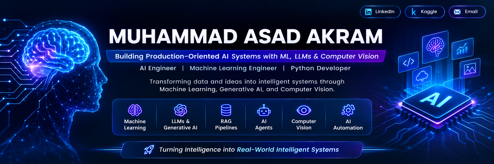

👋 Muhammad Asad Akram

Building Production-Oriented AI Systems with ML, LLMs & Computer Vision

AI Engineer focused on transforming data, machine learning, and intelligent automation into practical applications.

 

&nbsp;

&nbsp;

  

Machine Learning • LLMs & Generative AI • RAG • AI Agents • Computer Vision • AI Applications

⚡ About

I build end-to-end AI applications that combine machine learning, intelligent systems, backend engineering, and user-facing products.

My work focuses on moving beyond isolated models by connecting:

Data → Intelligence → APIs → Applications

The goal is to build practical AI systems that are usable, scalable, and designed around real-world problems.

A model is only the beginning. The real challenge is turning intelligence into a reliable system that people can actually use.

🧠 Core Expertise

<table>
<tr>
<td width="50%" valign="top">

🤖 Generative AI

LLM-powered applications

Retrieval-Augmented Generation

AI assistants

AI agents

Intelligent automation

Prompt engineering

</td>
<td width="50%" valign="top">

🧠 Machine Learning

Predictive analytics

Classification systems

Recommendation systems

Model inference pipelines

Data-driven applications

Explainable AI

</td>
</tr>
<tr>
<td width="50%" valign="top">

👁️ Computer Vision

Object detection

Image analysis

Video analytics

Real-time detection systems

</td>
<td width="50%" valign="top">

💬 NLP & Data Intelligence

Emotion detection

Sentiment analysis

Text processing

Personalized recommendations

Structured data analysis

</td>
</tr>
</table>

🛠️ Technology Stack

🐍 AI & Machine Learning

Python · Scikit-learn · Pandas · NumPy · SHAP

🤖 Generative AI

LLMs · Generative AI · RAG Pipelines · AI Agents · Prompt Engineering

👁️ Computer Vision & NLP

OpenCV · Computer Vision · Natural Language Processing · Sentiment Analysis

⚙️ Backend Engineering

FastAPI · Flask · REST APIs

🖥️ Frontend & Data

React · JavaScript · HTML · CSS · PostgreSQL

🔧 Development Tools

Git · GitHub

🚀 Featured AI Systems

🏥 AI Healthcare Prediction Platform

Machine Learning · Explainable AI · FastAPI · React

An AI-powered healthcare analytics platform designed to transform structured data into predictive insights.

What It Demonstrates

Multi-disease risk prediction

Machine learning inference pipelines

Explainable predictions using SHAP

FastAPI backend services

React analytics dashboard

PostgreSQL data management

API-driven prediction workflows

Architecture

User
  │
  ▼
React Dashboard
  │
  ▼
FastAPI Backend
  │
  ├───────────────┬────────────────┐
  ▼               ▼                ▼
ML Models      SHAP / XAI      PostgreSQL
  │               │                │
  └───────────────┴────────────────┘
                  │
                  ▼
         Predictive Insights

Tech: Python · Scikit-learn · FastAPI · React · SHAP · PostgreSQL

⚽ Football Data Intelligence Platform

Data Processing · Analytics · PostgreSQL · React

A data-driven application focused on transforming structured football data into useful performance intelligence.

What It Demonstrates

Structured data processing

Analytics pipelines

Performance intelligence

Interactive visualizations

Data-driven dashboards

Football Data
      ↓
Data Processing
      ↓
Analytics Pipeline
      ↓
Performance Intelligence
      ↓
Interactive Dashboard

Tech: Python · PostgreSQL · React · Data Analytics

🎵 Emotion Music AI

NLP · Emotion Detection · Recommendation Systems

An AI-powered application that connects emotion detection with personalized music recommendations.

User Input
    ↓
Emotion Detection
    ↓
NLP Processing
    ↓
Recommendation Engine
    ↓
Personalized Music Experience

Focus: Emotion Detection · NLP · Sentiment Analysis · Recommendation Systems

📂 Repository: Explore Emotion Music AI

🚦 Smart Traffic Management System

Machine Learning · Data Processing · Predictive Analytics

A machine learning-driven system focused on processing traffic data, identifying patterns, and generating intelligent insights.

Traffic Data
     ↓
Data Processing
     ↓
Machine Learning
     ↓
Traffic Intelligence
     ↓
Optimization Insights

Focus: Machine Learning · Data Processing · Predictive Analytics

📂 Repository: Explore Smart Traffic Management System

🔥 Fire & Smoke Detection System

Computer Vision · Deep Learning · OpenCV

A computer vision system focused on detecting fire and smoke from image and video streams.

What It Demonstrates

Image analysis

Video stream processing

Computer vision pipelines

Deep learning-based detection

Real-time detection workflows

Tech: Python · OpenCV · Computer Vision · Deep Learning

📂 Repository: Explore Fire & Smoke Detection System

🏗️ How I Build AI Systems

I approach AI applications as complete engineering systems, where intelligence is one component of a larger application architecture.

                    ┌─────────────────────┐
                    │    USER / CLIENT    │
                    └──────────┬──────────┘
                               │
                               ▼
                    ┌─────────────────────┐
                    │  APPLICATION LAYER  │
                    │   React / Web App   │
                    └──────────┬──────────┘
                               │
                               ▼
                    ┌─────────────────────┐
                    │   API / BACKEND     │
                    │      FastAPI        │
                    └──────────┬──────────┘
                               │
              ┌────────────────┼────────────────┐
              ▼                ▼                ▼
       ┌─────────────┐   ┌─────────────┐  ┌─────────────┐
       │ ML MODELS   │   │ LLM / RAG   │  │ DATA LAYER  │
       │             │   │ AI AGENTS   │  │ PostgreSQL  │
       └─────────────┘   └─────────────┘  └─────────────┘
              │                │                │
              └────────────────┼────────────────┘
                               ▼
                    ┌─────────────────────┐
                    │  INTELLIGENT OUTPUT │
                    └─────────────────────┘

🔨 Current Focus

Advanced LLM applications

Retrieval-Augmented Generation

AI agent workflows

Intelligent automation

Production-oriented AI architecture

Scalable machine learning systems

💡 What I Build

🤖 Intelligent AI Applications

LLM-powered applications

RAG systems

AI assistants

AI agent workflows

Intelligent automation

🧠 Machine Learning Systems

Predictive analytics

Classification systems

Recommendation engines

Model inference pipelines

Explainable AI applications

👁️ Computer Vision Solutions

Object detection

Image analysis

Video analytics

Real-time detection systems

⚙️ Full-Stack AI Applications

AI-powered REST APIs

FastAPI backend services

React dashboards

PostgreSQL-backed applications

End-to-end AI systems

📈 GitHub Activity

 

🎯 Engineering Philosophy

Don't just train models. Build systems that people can actually use.

Data
  +
Machine Learning
  +
Software Engineering
  +
APIs
  +
Automation
  +
User Experience
  =
Real-World AI Systems

Artificial Intelligence × Software Engineering × Automation

🤝 Let's Build Something Intelligent

I'm interested in collaborating on:

🚀 AI-powered products

🤖 LLM applications

🔎 RAG systems

🧠 Machine learning platforms

⚙️ Intelligent automation

👁️ Computer vision solutions

🌍 End-to-end AI applications

 

  

📍 Lahore, Pakistan

⭐ Explore the repositories and follow the journey.

BUILD · LEARN · DEPLOY · REPEAT 🚀

