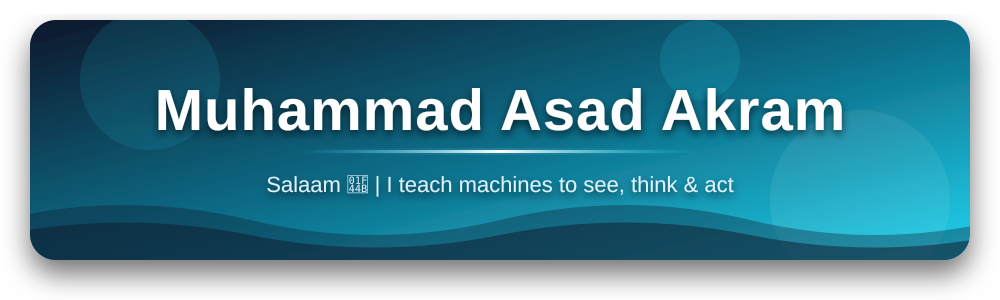

## Building Production-Oriented AI Systems with ML, LLM Agents & Computer Vision

**Turning models, data and automation into practical AI applications people can actually use.**

 

  

`Machine Learning` • `Deep Learning` • `LLM Agents` • `Computer Vision` • `Full-Stack AI`

---

## 👨‍💻 About Me

I am an AI Engineer focused on building practical, end-to-end intelligent applications using **Machine Learning, Deep Learning, LLM-powered agents, and Computer Vision**.

My work goes beyond training individual models. I connect **data, intelligence, APIs, automation and application layers** into systems designed for real-world use.

- 🔭 Building end-to-end AI applications, from model to dashboard
- 🤖 Working with **LLM agents and multi-agent orchestration** (Gemini)
- 👁️ Developing **real-time Computer Vision and detection systems** (YOLOv8, MediaPipe)
- ⚙️ Building **FastAPI / Flask backends, REST APIs and WebSocket dashboards**
- 🌐 Building for local users too: **Urdu + English** support
- 📍 Based in **Bahawalpur, Pakistan**

> **Don't just train models. Build systems that people can actually use.**

---

# 🛠️ Technology Stack

### 💻 Languages

### 🧠 Machine Learning & AI

  

`Pandas` · `NumPy` · `YOLOv8` · `MediaPipe` · `Gemini API`

### 👁️ Computer Vision

  

`Object Detection` · `Object Tracking` · `Homography` · `OCR / ANPR` · `Hand & Face Analysis`

### ⚙️ Backend, Mobile & Database

  

`SQLAlchemy` · `JWT Auth` · `REST APIs` · `Multi-Tenant SaaS` · `Pytest`

### 🔧 Development & Deployment

  

`Railway Cloud` · `CI/CD` · `Pytest`

---

# 🚀 Featured Projects

## 🌾 AI-Powered Grain Market ERP & Multi-Tenant Management System

**Full-Stack & Mobile · FastAPI · Flutter · Machine Learning · SaaS**

**Role:** Full-Stack & Mobile App Developer

A comprehensive, enterprise-grade Mandi ERP system that automates agricultural trade settlements, double-entry financial ledgers and crop price predictions. Built with a FastAPI REST backend and a cross-platform Flutter mobile app.

### Key Highlights

- **Custom Mandi Settlement Engine:** automated trade settlement with split-lot crop sales, multi-tier palledari deductions (Labour, Brokerage, Scale/Tulai charges) and dynamic Buyer/Farmer commission routing
- **Double-Entry Accounting:** chronological running-balance ledger engine with automatic historical balance recalculation for Farmers, Buyers (Mills) and Mandi Brokers
- **Multi-Tenant SaaS Architecture:** secure JWT-based multi-tenancy with isolated data access, so multiple grain market shops run on one infrastructure
- **Cross-Platform Mobile App:** responsive Flutter app with real-time settlement calculators, English/Urdu language toggle and smooth REST API integration
- **Predictive ML Insights:** Scikit-Learn models forecasting 7-day price trends for Wheat, Rice, Cotton, Chickpeas and Maize
- **Automated Testing & Deployment:** Pytest suite with a 100% pass rate and continuous deployment to Railway cloud

**Tech Stack:**
`Python` · `FastAPI` · `Flutter (Dart)` · `SQLAlchemy` · `SQLite` · `JWT Auth` · `Scikit-Learn` · `Pytest` · `REST APIs` · `Docker` · `Railway`

---

## 🤖 KhidmatAI: AI Services Orchestrator

**Multi-Agent AI · Gemini · FastAPI · Flutter**

An intelligent multi-agent platform that understands natural-language requests in English or Urdu (e.g. *"mujhe AC mechanic chahiye"*), finds real nearby providers and books them automatically.

### Key Highlights

- Five cooperating agents: Linguist, Matchmaker, Planner, Executor, Concierge
- Intent and urgency extraction with Google Gemini
- Live provider search using Google Places and OpenStreetMap
- Automated booking with Firebase Firestore
- FastAPI web UI plus Flutter mobile app
- Docker-ready deployment

**Tech Stack:**
`Python` · `FastAPI` · `Gemini` · `Firebase` · `Flutter` · `Docker`

🔗 **Repository:**
[View KhidmatAI](https://github.com/httpsasad/ai-services-orchestrator)

---

## 🚦 Smart Traffic Management System

**Computer Vision · YOLOv8 · Real-Time Analytics**

A real-time traffic analytics and dynamic signal-control platform with a live web dashboard.

### Key Highlights

- YOLOv8 vehicle detection and tracking
- Speed estimation (km/h) using homography calibration
- Automatic number plate recognition (ANPR) with SQLite logging
- Multi-lane density monitoring with LOW / MEDIUM / HIGH status
- Emergency-vehicle detection with green-signal override
- Live MJPEG stream, WebSocket updates and Chart.js analytics

**Tech Stack:**
`Python` · `YOLOv8` · `OpenCV` · `Flask-SocketIO` · `SQLite` · `Chart.js`

🔗 **Repository:**
[View Smart Traffic Management System](https://github.com/httpsasad/smart-traffic-management-system)

---

## 🔥 GuardianAI: Fire & Smoke Detection System

**Computer Vision · Deep Learning · Alerting**

An enterprise-style surveillance platform that detects fire and smoke from live camera streams and raises alerts instantly.

### Key Highlights

- YOLOv8 detection with an HSV colour-based fallback
- Multi-source input: webcam, video files and RTSP IP cameras
- Siren alarm with live mute control
- Email and Telegram alerts with snapshots
- ROI exclusion zones to ignore known heat sources
- Hourly incident analytics and one-click PDF audit reports

**Tech Stack:**
`Python` · `YOLOv8` · `OpenCV` · `Flask` · `Socket.IO` · `ReportLab`

🔗 **Repository:**
[View Fire & Smoke Detection System](https://github.com/httpsasad/fire_smoke_detection_system)

---

## ✋ AI Hand Gesture Air-Writing System

**Computer Vision · MediaPipe · Gemini**

Write in the air with your finger: a webcam tracks your hand and an AI model reads what you wrote.

### Key Highlights

- Real-time hand tracking with 21 landmarks per hand
- Gesture controls for draw, pause, erase, clear and colour change
- Smooth strokes using a moving-average filter
- Handwriting recognition with Google Gemini
- Save the canvas as PNG

**Tech Stack:**
`Python` · `OpenCV` · `MediaPipe` · `Gemini`

🔗 **Repository:**
[View Hand Gesture Project](https://github.com/httpsasad/Hand-Gesture)

---

## 🎵 Emotion Music AI Pro

**Emotion Detection · Deep Learning · Recommendation**

An AI application that detects human emotion and recommends music that matches the mood.

### Key Highlights

- Real-time emotion detection
- Mood-based music recommendation
- Personalized playlist generation
- Full-stack architecture

**Tech Stack:**
`Python` · `Deep Learning` · `OpenCV` · `Recommendation Systems`

🔗 **Repository:**
[View Emotion Music AI Pro](https://github.com/httpsasad/emotion-music-ai-pro)

---

# 🏗️ What I Build

<table>
<tr>
<td width="50%" valign="top">

### 🤖 AI Applications

- LLM-powered applications
- Multi-agent systems
- AI assistants
- Intelligent automation

</td>

<td width="50%" valign="top">

### 🧠 Machine Learning Systems

- Classification systems
- Recommendation engines
- Model inference pipelines
- Predictive analytics

</td>
</tr>

<tr>
<td width="50%" valign="top">

### 👁️ Computer Vision

- Object detection and tracking
- Gesture recognition
- Video analytics
- Real-time detection systems

</td>

<td width="50%" valign="top">

### ⚙️ Full-Stack AI

- FastAPI / Flask backends
- REST APIs and WebSockets
- Live dashboards
- Flutter mobile apps

</td>
</tr>
</table>

---

# 🔭 Current Focus

- Advanced LLM applications and agent workflows
- Production-oriented AI architecture
- Real-time computer vision systems
- Intelligent automation
- Scalable Machine Learning systems

---

# 📊 GitHub Stats

 

---

# 📈 Contribution Graph

---

# 🎯 Engineering Philosophy

> **A model is only the beginning.**

The real challenge is transforming intelligence into a reliable, usable, and practical system.

I enjoy building at the intersection of:

## **Artificial Intelligence × Software Engineering × Automation**

with a focus on creating intelligent products that solve real-world problems.

---

# 🤝 Let's Connect

I'm interested in collaborating on:

- 🚀 AI-powered products
- 🤖 LLM and multi-agent applications
- 🧠 Machine Learning solutions
- ⚙️ AI automation
- 👁️ Computer Vision applications
- 🌍 End-to-end AI products

 

  

### 📍 Bahawalpur, Pakistan

# BUILD · LEARN · DEPLOY · REPEAT 🚀

